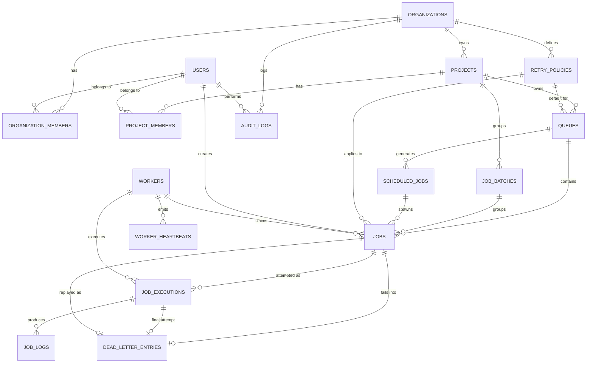

# Foreman — PostgreSQL Database Design
## Production Schema for the Distributed Job Scheduling Platform

*Source of truth: `Foreman_Architecture_Blueprint.md`. This document is the schema-level follow-on referenced in that blueprint's §8. No implementation code — DDL-equivalent specification only.*

---

## 1. Design Principles (applied globally)

| Decision | Choice | Why |
|---|---|---|
| Primary keys | `UUID` (v4, generated via `gen_random_uuid()` from `pgcrypto`, or app-side UUIDv7) | Multi-tenant system with independently-scaling services (API, Scheduler, Workers) that must generate IDs without a central sequence authority; no auto-increment coordination across replicas; safe to expose in APIs without leaking row counts. |
| Semi-structured data | `JSONB` for `payload`, `result`, `metadata`, `error_context` | Job types are open-ended and evolve without platform migrations (per blueprint §11 "Schema churn" risk). Core lifecycle fields (status, timestamps, queue_id) stay strongly typed and indexed; only the *variable* part is JSONB. |
| Timestamps | `TIMESTAMPTZ` everywhere, `created_at` default `now()`, `updated_at` maintained by trigger | Multi-region correctness; never store naive local time. |
| Soft vs hard delete | Soft delete (`deleted_at TIMESTAMPTZ NULL`) on tenant/config entities (`organizations`, `projects`, `queues`, `users`, `retry_policies`); hard delete only for high-volume operational/time-series data (`worker_heartbeats`, `job_logs` beyond retention) | Config entities need recoverability and referential history (a deleted queue is still referenced by historical jobs). High-volume operational rows are pruned/partitioned, not soft-deleted — soft-deleting millions of heartbeat rows just to purge them later doubles the work. |
| Concurrency model | Pessimistic locking (`SELECT … FOR UPDATE SKIP LOCKED`) for job claiming; optimistic locking (`version` column) for config mutations (queue settings, retry policy edits) | Explained in full in §5 and §6. |
| Enum-like fields | Postgres `ENUM` types for closed, stable sets (`job_status`, `worker_status`, `execution_status`); `VARCHAR` + CHECK for sets likely to grow (`retry_strategy`) | Enums are fast and self-documenting but require a migration to add a value — acceptable for lifecycle states that are architecturally fixed, avoided for things product will extend. |

---

## 2. Entity Tables

### 2.1 `users`
**Purpose:** Authentication identity and profile. Owned solely by API Service.

| Column | Type | Constraints |
|---|---|---|
| id | UUID | PK, default `gen_random_uuid()` |
| email | CITEXT | UNIQUE, NOT NULL |
| password_hash | TEXT | NOT NULL |
| full_name | TEXT | NOT NULL |
| is_active | BOOLEAN | NOT NULL, default `true` |
| last_login_at | TIMESTAMPTZ | NULL |
| created_at | TIMESTAMPTZ | NOT NULL, default `now()` |
| updated_at | TIMESTAMPTZ | NOT NULL, default `now()` |
| deleted_at | TIMESTAMPTZ | NULL (soft delete) |

**Relationships:** referenced by `organization_members`, `project_members`, `jobs.created_by`, `audit_logs.actor_id`.
**Indexes:** `UNIQUE (email) WHERE deleted_at IS NULL` (partial unique — allows email reuse after soft-delete).

---

### 2.2 `organizations`
**Purpose:** Top-level tenant boundary. Everything else hangs off an organization.

| Column | Type | Constraints |
|---|---|---|
| id | UUID | PK, default `gen_random_uuid()` |
| name | TEXT | NOT NULL |
| slug | TEXT | UNIQUE, NOT NULL |
| plan_tier | TEXT | NOT NULL, default `'free'` |
| created_at | TIMESTAMPTZ | NOT NULL, default `now()` |
| updated_at | TIMESTAMPTZ | NOT NULL, default `now()` |
| deleted_at | TIMESTAMPTZ | NULL |

**Indexes:** `UNIQUE (slug) WHERE deleted_at IS NULL`.

---

### 2.3 `organization_members`
**Purpose:** Many-to-many User ↔ Organization with a role, forming the top RBAC layer.

| Column | Type | Constraints |
|---|---|---|
| id | UUID | PK, default `gen_random_uuid()` |
| organization_id | UUID | FK → `organizations(id)` ON DELETE CASCADE, NOT NULL |
| user_id | UUID | FK → `users(id)` ON DELETE CASCADE, NOT NULL |
| role | TEXT | NOT NULL, CHECK IN (`'owner'`,`'admin'`,`'member'`,`'viewer'`) |
| created_at | TIMESTAMPTZ | NOT NULL, default `now()` |

**Constraints:** `UNIQUE (organization_id, user_id)`.
**Cascade rationale:** membership is meaningless without both parents; if the org or the user is hard-deleted, membership rows should disappear. (Orgs/users are normally soft-deleted in practice, so this CASCADE is a safety net, not the primary deletion path.)
**Indexes:** `(user_id)` — "which orgs does this user belong to" is a login-time lookup.

---

### 2.4 `projects`
**Purpose:** Owned by an organization; the unit that owns queues.

| Column | Type | Constraints |
|---|---|---|
| id | UUID | PK, default `gen_random_uuid()` |
| organization_id | UUID | FK → `organizations(id)` ON DELETE CASCADE, NOT NULL |
| name | TEXT | NOT NULL |
| slug | TEXT | NOT NULL |
| created_by | UUID | FK → `users(id)` ON DELETE SET NULL |
| created_at | TIMESTAMPTZ | NOT NULL, default `now()` |
| updated_at | TIMESTAMPTZ | NOT NULL, default `now()` |
| deleted_at | TIMESTAMPTZ | NULL |

**Constraints:** `UNIQUE (organization_id, slug)`.
**Cascade rationale:** a project cannot outlive its organization — CASCADE. `created_by` uses SET NULL: deleting the creator's user account shouldn't delete the project or its jobs (data outlives the individual).
**Indexes:** `(organization_id) WHERE deleted_at IS NULL`.

---

### 2.5 `project_members`
**Purpose:** Fine-grained, optional project-level RBAC layer (overrides/extends org role for a specific project).

| Column | Type | Constraints |
|---|---|---|
| id | UUID | PK, default `gen_random_uuid()` |
| project_id | UUID | FK → `projects(id)` ON DELETE CASCADE, NOT NULL |
| user_id | UUID | FK → `users(id)` ON DELETE CASCADE, NOT NULL |
| role | TEXT | NOT NULL, CHECK IN (`'admin'`,`'member'`,`'viewer'`) |
| created_at | TIMESTAMPTZ | NOT NULL, default `now()` |

**Constraints:** `UNIQUE (project_id, user_id)`.
**Indexes:** `(user_id)`.

---

### 2.6 `retry_policies`
**Purpose:** Reusable retry strategy definitions, referenced by queues (and optionally overridden per job).

| Column | Type | Constraints |
|---|---|---|
| id | UUID | PK, default `gen_random_uuid()` |
| organization_id | UUID | FK → `organizations(id)` ON DELETE CASCADE, NOT NULL |
| name | TEXT | NOT NULL |
| strategy | VARCHAR(20) | NOT NULL, CHECK IN (`'fixed'`,`'linear'`,`'exponential'`) |
| base_delay_seconds | INTEGER | NOT NULL, CHECK (`base_delay_seconds >= 0`) |
| max_delay_seconds | INTEGER | NULL, CHECK (`max_delay_seconds >= base_delay_seconds`) |
| max_attempts | INTEGER | NOT NULL, default `3`, CHECK (`max_attempts > 0`) |
| jitter | BOOLEAN | NOT NULL, default `true` |
| created_at | TIMESTAMPTZ | NOT NULL, default `now()` |
| updated_at | TIMESTAMPTZ | NOT NULL, default `now()` |
| deleted_at | TIMESTAMPTZ | NULL |

**Constraints:** `UNIQUE (organization_id, name) WHERE deleted_at IS NULL`.
**Note on `strategy` as VARCHAR+CHECK, not ENUM:** retry strategies are a small product surface likely to gain variants (e.g., "fibonacci", "custom curve") — a CHECK constraint is a one-line migration versus an ENUM's `ALTER TYPE`.

---

### 2.7 `queues`
**Purpose:** Queue configuration — priority tier, concurrency ceiling, retry policy reference, pause flag.

| Column | Type | Constraints |
|---|---|---|
| id | UUID | PK, default `gen_random_uuid()` |
| project_id | UUID | FK → `projects(id)` ON DELETE CASCADE, NOT NULL |
| name | TEXT | NOT NULL |
| priority_tier | SMALLINT | NOT NULL, default `0` |
| max_concurrency | INTEGER | NOT NULL, default `10`, CHECK (`max_concurrency > 0`) |
| retry_policy_id | UUID | FK → `retry_policies(id)` ON DELETE SET NULL |
| is_paused | BOOLEAN | NOT NULL, default `false` |
| version | INTEGER | NOT NULL, default `1` (optimistic lock) |
| created_at | TIMESTAMPTZ | NOT NULL, default `now()` |
| updated_at | TIMESTAMPTZ | NOT NULL, default `now()` |
| deleted_at | TIMESTAMPTZ | NULL |

**Constraints:** `UNIQUE (project_id, name) WHERE deleted_at IS NULL`.
**Cascade rationale:** `retry_policy_id` uses SET NULL — deleting a retry policy shouldn't delete the queue; the queue falls back to a platform default until reassigned.
**Indexes:** `(project_id) WHERE deleted_at IS NULL` (dashboard queue list); `(id) WHERE is_paused = false` (claim-query fast path, see §5).

---

### 2.8 `jobs`
**Purpose:** Core job record — the row every other execution-related table hangs off. This is the highest-write-volume table in the system.

| Column | Type | Constraints |
|---|---|---|
| id | UUID | PK, default `gen_random_uuid()` |
| queue_id | UUID | FK → `queues(id)` ON DELETE RESTRICT, NOT NULL |
| batch_id | UUID | FK → `job_batches(id)` ON DELETE SET NULL, NULL |
| scheduled_job_id | UUID | FK → `scheduled_jobs(id)` ON DELETE SET NULL, NULL |
| job_type | TEXT | NOT NULL |
| status | job_status (ENUM) | NOT NULL, default `'queued'` |
| priority | INTEGER | NOT NULL, default `0` |
| payload | JSONB | NOT NULL, default `'{}'` |
| result | JSONB | NULL |
| idempotency_key | TEXT | NULL |
| retry_policy_id | UUID | FK → `retry_policies(id)` ON DELETE SET NULL |
| attempt_count | INTEGER | NOT NULL, default `0` |
| max_attempts | INTEGER | NOT NULL, default `3` |
| run_at | TIMESTAMPTZ | NULL (immediate jobs: NULL; delayed: future timestamp) |
| claimed_by | UUID | FK → `workers(id)` ON DELETE SET NULL, NULL |
| claimed_at | TIMESTAMPTZ | NULL |
| started_at | TIMESTAMPTZ | NULL |
| completed_at | TIMESTAMPTZ | NULL |
| created_by | UUID | FK → `users(id)` ON DELETE SET NULL |
| created_at | TIMESTAMPTZ | NOT NULL, default `now()` |
| updated_at | TIMESTAMPTZ | NOT NULL, default `now()` |

`job_status` ENUM: `'scheduled'`, `'queued'`, `'claimed'`, `'running'`, `'completed'`, `'failed'`, `'dead_letter'`, `'cancelled'`.

**Cascade rationale:**
- `queue_id` → **RESTRICT**, not CASCADE. A queue cannot be hard-deleted while jobs reference it — this forces an explicit archival/reassignment decision rather than silently vaporizing job history. (Soft-deleting the queue is fine; jobs keep their FK.)
- `batch_id`, `scheduled_job_id`, `retry_policy_id`, `claimed_by`, `created_by` all **SET NULL** — none of these are the job's identity; losing the parent shouldn't lose the job record.

**Constraints:** `UNIQUE (queue_id, idempotency_key) WHERE idempotency_key IS NOT NULL` — prevents duplicate submission of the same logical job within a queue.

**Indexes (performance-critical — see §5 for the claim query):**
- `idx_jobs_claim (queue_id, priority DESC, created_at ASC) WHERE status = 'queued'` — the atomic claim query's primary index; partial index keeps it small regardless of historical job volume.
- `idx_jobs_run_at (run_at) WHERE status = 'scheduled'` — Scheduler's due-job scan.
- `idx_jobs_status_queue (queue_id, status)` — dashboard filtering/counts per queue.
- `idx_jobs_batch (batch_id) WHERE batch_id IS NOT NULL` — batch status aggregation.
- `idx_jobs_payload_gin (payload) USING GIN` — optional, only if the dashboard needs to filter/search inside payloads; omit if unused (GIN indexes are expensive to maintain on a hot write table).

---

### 2.9 `scheduled_jobs`
**Purpose:** Persistent delayed/cron/recurring *definitions* that generate rows in `jobs` when due. Decouples "the recurring rule" from "one firing."

| Column | Type | Constraints |
|---|---|---|
| id | UUID | PK, default `gen_random_uuid()` |
| queue_id | UUID | FK → `queues(id)` ON DELETE CASCADE, NOT NULL |
| job_type | TEXT | NOT NULL |
| payload_template | JSONB | NOT NULL, default `'{}'` |
| schedule_type | VARCHAR(20) | NOT NULL, CHECK IN (`'once'`,`'cron'`) |
| cron_expression | TEXT | NULL, CHECK (schedule_type <> 'cron' OR cron_expression IS NOT NULL) |
| run_at | TIMESTAMPTZ | NULL (for `'once'`) |
| next_run_at | TIMESTAMPTZ | NULL |
| last_run_at | TIMESTAMPTZ | NULL |
| is_active | BOOLEAN | NOT NULL, default `true` |
| created_by | UUID | FK → `users(id)` ON DELETE SET NULL |
| created_at | TIMESTAMPTZ | NOT NULL, default `now()` |
| updated_at | TIMESTAMPTZ | NOT NULL, default `now()` |
| deleted_at | TIMESTAMPTZ | NULL |

**Cascade rationale:** CASCADE from `queues` — a recurring definition has no meaning without its queue (unlike `jobs`, which keeps history value even if we wanted to restrict; here the definition itself is disposable config).
**Indexes:** `idx_scheduled_jobs_due (next_run_at) WHERE is_active = true AND deleted_at IS NULL` — the Scheduler's only query.

---

### 2.10 `job_executions`
**Purpose:** One row per *attempt* of a job — this is what makes retry history queryable. A job with 3 retries has 1 `jobs` row and up to 4 `job_executions` rows.

| Column | Type | Constraints |
|---|---|---|
| id | UUID | PK, default `gen_random_uuid()` |
| job_id | UUID | FK → `jobs(id)` ON DELETE CASCADE, NOT NULL |
| worker_id | UUID | FK → `workers(id)` ON DELETE SET NULL |
| attempt_number | INTEGER | NOT NULL |
| status | execution_status (ENUM) | NOT NULL, default `'running'` |
| started_at | TIMESTAMPTZ | NOT NULL, default `now()` |
| finished_at | TIMESTAMPTZ | NULL |
| duration_ms | INTEGER | NULL |
| error_message | TEXT | NULL |
| error_context | JSONB | NULL |
| created_at | TIMESTAMPTZ | NOT NULL, default `now()` |

`execution_status` ENUM: `'running'`, `'succeeded'`, `'failed'`, `'timed_out'`.

**Constraints:** `UNIQUE (job_id, attempt_number)`.
**Cascade rationale:** CASCADE from `jobs` — an execution attempt has zero standalone meaning without its parent job; deleting a job (rare, e.g., GDPR erasure) should take its execution history with it. `worker_id` SET NULL — the worker record is operational metadata, not part of the execution's identity.
**Indexes:** `(job_id, attempt_number)` (covered by unique constraint); `(worker_id, started_at)` — "what did this worker run recently," used by reclaim logic and dashboards.

---

### 2.11 `job_logs`
**Purpose:** Structured, incremental log lines/events tied to an execution attempt (per blueprint §3: "writes execution logs incrementally, not just at completion").

| Column | Type | Constraints |
|---|---|---|
| id | BIGINT | PK, `GENERATED ALWAYS AS IDENTITY` |
| job_execution_id | UUID | FK → `job_executions(id)` ON DELETE CASCADE, NOT NULL |
| log_level | VARCHAR(10) | NOT NULL, default `'info'` |
| message | TEXT | NOT NULL |
| metadata | JSONB | NULL |
| logged_at | TIMESTAMPTZ | NOT NULL, default `now()` |

**Why `BIGINT IDENTITY` instead of UUID here:** this is the highest-cardinality, purely append-only, internally-consumed table (never referenced *by* another table as a parent) — a sequential bigint is smaller, faster to index, and naturally orders by insertion, which UUIDv4 does not. This is the one deliberate exception to the UUID-everywhere rule.
**Cascade rationale:** CASCADE from `job_executions` — logs are meaningless orphaned.
**Indexes:** `(job_execution_id, logged_at)` — the only real access pattern (fetch a job's log stream in order).
**Partitioning:** see §9 — this table is the primary partitioning candidate.

---

### 2.12 `workers`
**Purpose:** Registered worker instances — identity, capacity, current status.

| Column | Type | Constraints |
|---|---|---|
| id | UUID | PK, default `gen_random_uuid()` |
| hostname | TEXT | NOT NULL |
| status | worker_status (ENUM) | NOT NULL, default `'starting'` |
| capacity | INTEGER | NOT NULL, default `1`, CHECK (`capacity > 0`) |
| assigned_queue_ids | UUID[] | NULL (NULL = services all queues) |
| last_heartbeat_at | TIMESTAMPTZ | NULL |
| started_at | TIMESTAMPTZ | NOT NULL, default `now()` |
| stopped_at | TIMESTAMPTZ | NULL |

`worker_status` ENUM: `'starting'`, `'active'`, `'draining'`, `'unresponsive'`, `'stopped'`.

**Indexes:** `idx_workers_heartbeat (last_heartbeat_at) WHERE status IN ('active','draining')` — the reaper's only query (find workers past the heartbeat threshold).
**Note:** `assigned_queue_ids` as an array is intentional denormalization — it's read far more than written (once at worker startup, read on every claim-routing decision) and a join table would add cost with no query benefit here, since workers never need to be queried "from" the queue side in the hot path.

---

### 2.13 `worker_heartbeats`
**Purpose:** Time-series liveness pings. Kept separate from `workers.last_heartbeat_at` (which is the *current* denormalized value) to retain a heartbeat history for diagnostics without bloating the workers table with UPDATEs.

| Column | Type | Constraints |
|---|---|---|
| id | BIGINT | PK, `GENERATED ALWAYS AS IDENTITY` |
| worker_id | UUID | FK → `workers(id)` ON DELETE CASCADE, NOT NULL |
| heartbeat_at | TIMESTAMPTZ | NOT NULL, default `now()` |
| active_job_count | INTEGER | NOT NULL, default `0` |
| cpu_usage_pct | REAL | NULL |
| memory_usage_mb | INTEGER | NULL |

**Cascade rationale:** CASCADE — heartbeat history has no meaning without the worker.
**Indexes:** `(worker_id, heartbeat_at DESC)`.
**Retention:** this table is high-volume and low-value beyond a short window — see §9 (partition by time, drop old partitions; do not soft-delete row-by-row).

---

### 2.14 `dead_letter_entries`
**Purpose:** Permanently failed jobs, with failure context and a replay link back to a re-queued job.

| Column | Type | Constraints |
|---|---|---|
| id | UUID | PK, default `gen_random_uuid()` |
| job_id | UUID | FK → `jobs(id)` ON DELETE CASCADE, NOT NULL |
| final_execution_id | UUID | FK → `job_executions(id)` ON DELETE SET NULL |
| failure_reason | TEXT | NOT NULL |
| failure_context | JSONB | NULL |
| replayed_job_id | UUID | FK → `jobs(id)` ON DELETE SET NULL, NULL |
| replayed_at | TIMESTAMPTZ | NULL |
| replayed_by | UUID | FK → `users(id)` ON DELETE SET NULL |
| created_at | TIMESTAMPTZ | NOT NULL, default `now()` |

**Constraints:** `UNIQUE (job_id)` — a job lands in the DLQ at most once (a replay creates a *new* job row, not a re-entry into the same DLQ record).
**Cascade rationale:** CASCADE from `jobs` on `job_id` — if the original job is purged, the DLQ record (which is *about* that job) goes with it. `replayed_job_id` SET NULL — the replay child is an independent job with its own lifecycle.
**Indexes:** `(job_id)` (covered by unique); `(created_at)` for DLQ dashboard chronological listing.

---

### 2.15 `job_batches`
**Purpose:** Groups jobs submitted together; batch status is derived/aggregated from children, not stored as an independently-writable field (avoids drift).

| Column | Type | Constraints |
|---|---|---|
| id | UUID | PK, default `gen_random_uuid()` |
| project_id | UUID | FK → `projects(id)` ON DELETE CASCADE, NOT NULL |
| name | TEXT | NULL |
| total_jobs | INTEGER | NOT NULL, default `0` |
| created_by | UUID | FK → `users(id)` ON DELETE SET NULL |
| created_at | TIMESTAMPTZ | NOT NULL, default `now()` |

**Note:** no `status`/`completed_count` columns here by design — those are computed on read via `SELECT status, count(*) FROM jobs WHERE batch_id = $1 GROUP BY status` (indexed via `idx_jobs_batch`). Storing a running counter would need every job completion to `UPDATE job_batches`, creating write contention on a single row shared by N jobs — exactly the kind of hotspot the claim design elsewhere avoids. If batch dashboards get read-heavy at scale, a periodically-refreshed materialized view is the escape hatch, not a live counter.
**Indexes:** `(project_id, created_at)`.

---

### 2.16 `audit_logs`
**Purpose:** Cross-cutting, append-only record of privileged actions (retries, pauses, RBAC changes, DLQ replays).

| Column | Type | Constraints |
|---|---|---|
| id | BIGINT | PK, `GENERATED ALWAYS AS IDENTITY` |
| organization_id | UUID | FK → `organizations(id)` ON DELETE CASCADE, NOT NULL |
| actor_id | UUID | FK → `users(id)` ON DELETE SET NULL |
| action | TEXT | NOT NULL |
| target_type | TEXT | NOT NULL |
| target_id | UUID | NULL |
| metadata | JSONB | NULL |
| created_at | TIMESTAMPTZ | NOT NULL, default `now()` |

**Note:** `target_id` has no FK — it's polymorphic (points at whichever table `target_type` names). Enforcing referential integrity here would require a trigger per target type for marginal benefit; audit logs must survive even if the target row is later hard-deleted, so a loose reference is actually the *correct* choice, not a shortcut.
**Cascade rationale:** `actor_id` SET NULL — the audit trail must survive deletion of the acting user's account (compliance requirement: "who did this" should say "deleted user", never disappear). `organization_id` CASCADE only because an org's audit log is meaningless once the tenant itself is gone.
**Indexes:** `(organization_id, created_at DESC)` — the audit view's only query pattern.

---

## 3. Why UUID (expanded)

- **No coordination across services.** API, Scheduler, and Workers all insert rows independently; a `SERIAL`/`BIGSERIAL` PK would work fine too since Postgres owns the sequence, but UUIDs additionally let job IDs be generated *client-side* (e.g., for idempotent retries of a submission call) before the row exists.
- **Safe external exposure.** Job/queue IDs appear in API responses and URLs; sequential integers leak volume ("we're on job #40,000,231") and enable enumeration attacks. UUIDs don't.
- **Merge-safety.** If Foreman ever needs to backfill, migrate between environments, or merge data from a staging import, UUID PKs never collide; integer PKs would need remapping.
- **Trade-off acknowledged:** UUIDv4 is 16 bytes vs. 4/8 for int/bigint, and random UUIDs fragment B-tree index locality (worse cache behavior on insert-heavy tables like `jobs`). Mitigation: use **UUIDv7** (time-ordered) at the application layer wherever the driver/library supports it — same API-facing properties as v4, but monotonic-ish, which keeps the `jobs` and `job_executions` primary key indexes append-mostly instead of randomly scattered. This is called out explicitly because `jobs` is the highest-write table in the system.

---

## 4. Why JSONB (expanded)

Used only where the schema legitimately varies per caller, never as a substitute for known, queryable columns:

| Column | Why JSONB and not typed columns |
|---|---|
| `jobs.payload` | Every job type has a different shape; new job types must not require a migration. |
| `jobs.result` | Same — a "resize image" job returns different data than a "send email" job. |
| `job_executions.error_context` | Stack traces, external API error bodies — unpredictable shape, diagnostic-only, never filtered on in a hot query. |
| `scheduled_jobs.payload_template` | Template for generated job payloads — same variability as `jobs.payload`. |
| `audit_logs.metadata` | Each action type logs different details (e.g., "old role" vs "new role" for RBAC change, "queue paused reason" for pause). |

**What is deliberately *not* JSONB:** `status`, `priority`, `queue_id`, all timestamps, all foreign keys — anything the claim query, dashboard filters, or indexes need to touch stays a typed, indexed column. JSONB is for data Foreman *stores and displays* but does not *make lifecycle decisions on*.

---

## 5. Atomic Job Claiming — the core correctness mechanism

This is the single most important query in the system (blueprint §3, §11: "Duplicate job execution" is the top architectural risk).

**Pattern:**

```sql
WITH candidate AS (
  SELECT id
  FROM jobs
  WHERE queue_id = $1
    AND status = 'queued'
    AND (run_at IS NULL OR run_at <= now())
  ORDER BY priority DESC, created_at ASC
  LIMIT 1
  FOR UPDATE SKIP LOCKED
)
UPDATE jobs
SET status = 'claimed',
    claimed_by = $2,
    claimed_at = now(),
    attempt_count = attempt_count + 1,
    updated_at = now()
FROM candidate
WHERE jobs.id = candidate.id
RETURNING jobs.*;
```

**Why this is safe under N concurrent workers:**
- `FOR UPDATE` takes a row-level lock on the candidate row inside the transaction.
- `SKIP LOCKED` means a second worker's concurrent query never blocks waiting on a row worker #1 is already locking — it simply skips it and finds the *next* eligible row instead. No worker ever waits on another worker; no deadlocks; no thundering-herd stall.
- The `WHERE status = 'queued'` predicate is re-checked as part of the same locked read — if two transactions somehow raced to the same row before locks were acquired, only one `UPDATE` commits the state transition; the loser's `WHERE` no longer matches after the winner commits (or the row is simply gone from the locked candidate set), so it naturally retries against the next row.
- Concurrency limiting (queue's `max_concurrency`) is enforced by adding `AND (SELECT count(*) FROM jobs WHERE queue_id = $1 AND status = 'running') < (SELECT max_concurrency FROM queues WHERE id = $1)` as an additional CTE predicate, or by checking it in the same transaction before issuing the claim — kept out of the base query above for readability.
- This is a single, short-lived transaction — lock hold time is milliseconds, so it scales to a large worker fleet without the claim step itself becoming the bottleneck (blueprint §11 addresses this directly).

**Why the `Claimed` → `Running` split matters here:** the claim transaction only ever sets `claimed`. A separate, later transaction moves `claimed → running` once the worker actually starts executing. This means a worker that crashes *between* claiming and starting is distinguishable (stuck in `claimed`) from one that crashed mid-execution (stuck in `running`) — both are caught by the same heartbeat-timeout reaper query, but the distinction is valuable for diagnostics.

---

## 6. Optimistic vs. Pessimistic Locking — where each is used

| Use case | Lock type | Why |
|---|---|---|
| Job claiming | **Pessimistic** (`FOR UPDATE SKIP LOCKED`) | High contention by design (many workers racing for the same small set of `queued` rows); optimistic locking here would mean most workers' claim attempts *fail and retry* under load instead of cleanly skipping to the next available row — SKIP LOCKED is purpose-built for exactly this producer/consumer pattern. |
| Queue config edits (pause, concurrency change) | **Optimistic** (`version` column, `UPDATE … WHERE id = $1 AND version = $2`, reject on 0 rows affected) | Low contention (an admin editing settings), infrequent writes, and the cost of a rare conflict (ask the user to reload and reapply) is acceptable and simpler than holding a lock across a human-speed UI interaction. |
| Retry policy edits | **Optimistic** (same pattern) | Same reasoning — config, not hot-path data. |
| Batch status | **Neither — computed on read** | See §2.15; avoiding a shared mutable counter sidesteps the lock question entirely. |

---

## 7. Why PostgreSQL, Not Redis, Is the Source of Truth for Claiming

- **Durability of the decision itself.** `FOR UPDATE SKIP LOCKED` runs inside a transaction with WAL-backed durability — once committed, the claim survives a crash of the claiming worker, the database restarting, or a network partition. Redis operations (even `WATCH`/`MULTI` or Lua scripts) can be lost on a Redis restart unless persistence (AOF/RDB) is tuned aggressively, and even then introduce a second durability story to reason about.
- **Single source avoids split-brain.** If claim state lived in Redis while job *data* lived in Postgres, a Redis/Postgres inconsistency window (Redis says claimed, Postgres still says queued, or vice versa after a Redis flush/failover) becomes a class of bug the team must design around. Keeping the authoritative state in one system removes that failure mode by construction (blueprint §3, §11).
- **Redis failure degrades performance, not correctness.** Per the blueprint's explicit design goal: if Redis is flushed, workers fall back to polling Postgres directly — slower, but zero jobs are lost or double-claimed, because Postgres never depended on Redis for correctness in the first place.
- **Redis is still valuable — for the right job.** Pub/sub wake-up signaling and scheduler leader election don't need ACID guarantees; a missed signal just means a worker polls slightly later, and a lost leader lock just means brief re-election. That's an appropriate risk profile for a coordination hint, not for the record of whether a job has been executed.

---

## 8. Cascade Rules — summary table

| Parent → Child | Rule | Reasoning |
|---|---|---|
| organizations → organization_members, projects | CASCADE | Membership/projects have no meaning without the tenant. |
| organizations → retry_policies, audit_logs | CASCADE | Same — org-scoped config and logs. |
| projects → project_members, queues, job_batches | CASCADE | Project-scoped entities. |
| queues → scheduled_jobs | CASCADE | Recurring definitions are disposable queue config. |
| queues → jobs | **RESTRICT** | Job history must not silently vanish; forces explicit handling. |
| jobs → job_executions | CASCADE | Executions are meaningless without the job. |
| jobs → dead_letter_entries | CASCADE | DLQ record is *about* a specific job. |
| job_executions → job_logs | CASCADE | Logs are meaningless without the execution. |
| workers → worker_heartbeats | CASCADE | Heartbeat history is worker-scoped. |
| users → * (as actor/creator: created_by, claimed_by, actor_id, replayed_by) | **SET NULL** | Business data must outlive an individual account; the "who" becomes anonymous, not the record itself. |
| retry_policies → queues, jobs | **SET NULL** | Deleting a policy shouldn't delete what used it — falls back to a default. |
| job_batches / scheduled_jobs → jobs | **SET NULL** | A job is a first-class record independent of how it was created. |

**General principle:** CASCADE is used only within a clear ownership hierarchy where the child is *definitionally* scoped to the parent (a log line has no independent existence). Everything that's merely a *reference* (who created it, what policy applies, which batch it came from) is SET NULL. RESTRICT is reserved for the one case (`queues → jobs`) where silent cascading deletion would destroy auditable history that the business almost certainly wants to keep.

---

## 9. Partitioning Strategy

Three tables are the volume drivers and are the partitioning candidates; the rest stay unpartitioned (low volume, no benefit):

| Table | Partition by | Scheme |
|---|---|---|
| `job_logs` | RANGE on `logged_at` | Monthly (or weekly at high volume) partitions; drop partitions past the retention window (e.g., 90 days) with `DETACH PARTITION` + `DROP TABLE` — instant, no row-by-row DELETE cost. |
| `worker_heartbeats` | RANGE on `heartbeat_at` | Daily partitions; retention is short (days, not months) since only recent heartbeats matter operationally — drop aggressively. |
| `jobs` (only if volume justifies it — see §11) | RANGE on `created_at` | Monthly partitions once historical job volume materially outweighs "hot" (recently active) jobs; the claim query's `WHERE status = 'queued'` predicate naturally lives almost entirely in the newest partition, keeping the working set small even as total history grows. |

`job_executions` is a candidate for the same treatment as `jobs` if/when it's partitioned, kept in sync (partition both by the same time boundary) since they're almost always queried together.

**Why not partition everything up front:** partitioning adds operational complexity (constraint exclusion planning, partition-maintenance automation, cross-partition unique constraints become awkward). It's introduced when a table's row count or the retention/deletion pattern actually demands it — consistent with the blueprint's "graceful degradation over premature optimization" principle (§12).

---

## 10. Audit Logging Strategy

- `audit_logs` is **append-only** — no UPDATE or DELETE path in application code (a DB role-level REVOKE on UPDATE/DELETE is a reasonable hardening step).
- Captures privileged/mutating actions only: RBAC changes, queue pause/resume, retry-policy edits, manual job retries, DLQ replays — not routine reads.
- `actor_id` is SET NULL on user deletion (never cascade-deleted) so the audit trail is permanent even if the account is gone — this is a compliance-driven design choice, not an oversight.
- `metadata JSONB` carries the actual "before/after" diff for each action type, keeping the fixed columns (`action`, `target_type`, `target_id`) queryable/filterable while the variable detail stays flexible.
- Distinguished from `job_logs`/`worker_heartbeats`: those are high-volume operational telemetry with a short retention window; `audit_logs` is low-volume, long-retention, compliance-oriented data — different tables, different partitioning/retention treatment, on purpose.

---

## 11. Concurrency Considerations & Bottleneck Analysis

**Where contention concentrates:**
1. **The claim query on hot queues.** Mitigated by `SKIP LOCKED` (no blocking) and the partial index `idx_jobs_claim` (small, hot index scoped to `status = 'queued'` rows only — doesn't grow with historical volume).
2. **Concurrency-limit check inside the claim transaction.** The `count(*) … WHERE status = 'running'` subquery re-scans running jobs on every claim attempt for a queue. At very high per-queue throughput this can itself become a hot spot. Mitigation path if it materializes: maintain a `queues.running_count` column updated via trigger (accepting the write-contention trade-off only if profiling shows the COUNT scan is the actual bottleneck — not before).
3. **`job_batches` status aggregation.** Deliberately avoided a shared-row counter (see §2.15); the read-side `GROUP BY` on the indexed `idx_jobs_batch` is the chosen trade-off, revisited with a materialized view only if batch dashboards become read-heavy at scale.
4. **Single-writer heartbeat volume.** With many workers heartbeating every 5–10s, `worker_heartbeats` is a high-insert, append-only table — no contention (each worker only touches its own rows) but real storage/IO volume, which is why it's the most aggressively partitioned-and-pruned table in the schema.
5. **Connection pool exhaustion**, not row locking, is the more likely real-world bottleneck at scale: every worker replica holds connections for polling + claiming + heartbeating. Mitigation: PgBouncer (transaction-mode pooling) in front of Postgres, sized to the worker fleet, independent of any schema change.

**Read/write separation:** heavy read traffic (dashboard job explorer, logs, metrics) can be routed to a Postgres read replica without touching the write path, since none of the claim logic requires read-after-write consistency guarantees stronger than "the dashboard is a few hundred ms behind" (per blueprint §11).

---

## 12. Future Scalability Considerations

- **Read replicas** for dashboard/reporting queries, isolating them from the write-heavy claim/heartbeat path.
- **Queue sharding** (bonus feature, per blueprint §12): if a single Postgres instance's write throughput becomes the ceiling, queues could be sharded across multiple Postgres instances keyed by `queue_id` hash — deferred deliberately until the simple single-instance design is proven insufficient.
- **Table partitioning graduation**: `jobs` and `job_executions` move from unpartitioned to time-partitioned once historical volume, not just current throughput, becomes the pain point (query planning cost, index bloat, vacuum duration).
- **Archival tier**: completed/failed jobs older than N months can be moved to a cheaper storage tier (a separate `jobs_archive` table, or exported to object storage) — keeps the hot `jobs` table lean without losing history entirely.
- **Materialized views** for expensive aggregate dashboards (throughput charts, per-queue SLA metrics) refreshed on an interval, rather than computed live against the operational tables.
- **Advisory locks** already used for scheduler leader election generalize cleanly to any future "exactly one instance does X" requirement without a new coordination mechanism.

---

## 13. Entity-Relationship Diagram



*(Rendered form intentionally omits low-cardinality lookup columns for readability; full column detail is in §2.)*

---

## 14. Normalization Summary

The schema is **3NF** throughout, with two deliberate, documented denormalizations — each called out rather than accidental:

1. **`workers.assigned_queue_ids` (array, not a join table)** — read-dominant, small cardinality per worker, no need to query "from" the queue side. See §2.12.
2. **`job_batches` has no live `status`/`completed_count`** — the *opposite* of denormalization (deliberately *not* caching a derived value) to avoid write contention; noted here because it's the same category of trade-off decision, made the other direction.

Everything else follows standard normal-form discipline: every non-key column depends on the whole key and nothing but the key (no transitive dependencies — e.g., `job_executions` doesn't repeat `queue_id`, it's reachable via `job_id → jobs.queue_id`), and repeating groups are broken into child tables (`job_executions` for attempts, `job_logs` for log lines, `worker_heartbeats` for pings) rather than array/JSON columns, specifically because those three are queried, filtered, and paginated independently — the exact signal that says "this needs to be its own table," as opposed to `payload`/`result`, which are opaque blobs nothing else joins against.
